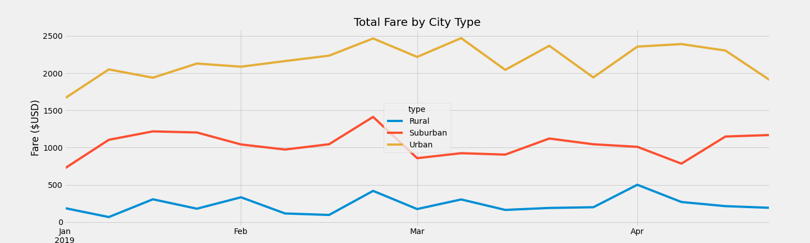

# PyBer_Analysis
## OverView
Purpose of this analysis is to go through ride sharing data to deterinmine key metrics allowing us to visualing to compare rural, surban, and urban cities' ride. Inlcuding total rides, drivers, and fares, as well as average fares per ride and per driver. This data was organized to various tables.
## Results

We see that Urban starts highest fares but fares going up and down from mid feb to end of march. For surban is the midrange price then after april fares becomes stable. While we the Rural is the lowest fare looks to have the stable prices after price hike in april. 
## Summary
Urban city types results is to compact, whcich means collecting a low average fare per ride, While Rurual is spread out collecting higher avg fare per ride. In order to test this theory, include the mileage distance data as part of the data collection process and analysis with PyBer. Since total drivers are more total rides in urban city types. Urban drivers does not have enough work to support their daily survivial stuff. Pyber could do some investment in advertersing dollars in Urban city types to increase total ride or risk loosing drivers in Urban area. 
